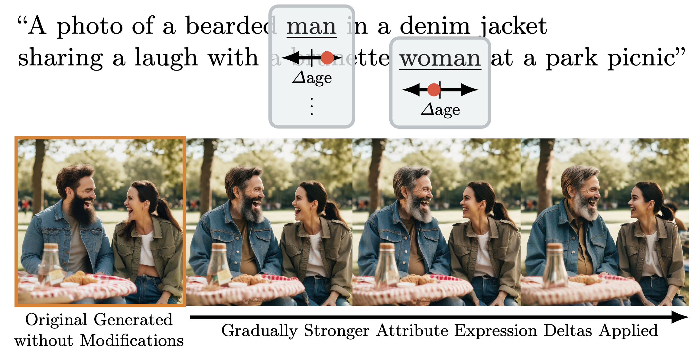

# Fine-Grained Subject-Specific Attribute Expression Control in T2I Models

[](https://compvis.github.io/attribute-control/)
[](https://arxiv.org/abs/2403.17064)
[](https://colab.research.google.com/github/CompVis/attribute-control/blob/main/notebooks/inference_sdxl_colab.ipynb)
[](https://replicate.com/camenduru/attribute-control)

This repository contains an implementation of the paper "Continuous, Subject-Specific Attribute Control in T2I Models by Identifying Semantic Directions".

[Stefan Andreas Baumann](https://stefan-baumann.eu/), [Felix Krause](https://www.linkedin.com/in/felixmkrause/), [Michael Neumayr](https://www.linkedin.com/in/michaelneumayr/), [Nick Stracke](https://de.linkedin.com/in/nick-stracke), [Vincent Tao Hu](https://taohu.me/), [Björn Ommer](https://ommer-lab.com/people/ommer/)

We present a simple, straight-forward method for enabling fine-grained control over attribute expression in T2I (diffusion) models in a subject-specific manner.
We identify meaningful directions in the tokenwise prompt embedding space that enable modulating single attributes for specific subjects without adapting the T2I model.



## 📰 News
- March 31, 2024: @camenduru built an [integration with replicate](https://replicate.com/camenduru/attribute-control) ([repository](https://github.com/camenduru/attribute-control-replicate))
- March 27, 2024: [Real Image Editing](https://github.com/CompVis/attribute-control/tree/main/notebooks/real_image_editing) demo added, thanks to @christianchartier for the suggestion!
- March 26, 2024: Preprint and Code released! 🎉

## 🚀 Usage
### Setup
Just clone the repo and install the requirements via `pip install -r requirements.txt`, then you're ready to go. For usage, see the examples below, everything else that's needed (model checkpoints) will be downloaded automatically.

### Inference
For inference, just start with one of the notebook at [`notebooks`](https://github.com/CompVis/attribute-control/tree/main/notebooks) or our [Colab Demo](https://colab.research.google.com/github/CompVis/attribute-control/blob/main/notebooks/inference_sdxl_colab.ipynb) for a minimal example.

We provide a range of learned deltas for SDXL at [`pretrained_deltas`](https://github.com/CompVis/attribute-control/tree/main/pretrained_deltas). These can also be used for models such as SD 1.5 or LDM3D by just loading them as usual.

### Real Image Editing
We also provide an example for real image editing at [`notebooks/real_image_editing`](https://github.com/CompVis/attribute-control/tree/main/notebooks/real_image_editing) based on [ReNoise](https://garibida.github.io/ReNoise-Inversion/) and [SDXL Turbo](https://stability.ai/news/stability-ai-sdxl-turbo).
This allows you to do real image editing with our method, e.g. changing the age of a car in a fine-grained way:


### Creating new Attribute Deltas
When creating deltas for new attributes, start by creating a config for them akin to `configs/prompts/people/age.yaml`. There are multiple entries of base prompts that correspond to the attribute in a neutral, "negative", and "positive" direction. Please make sure to use the same noun for all the prompts per entry and specify it as the `pattern_target`.
You can also specify a list of prefixes that contain various other words that will be added before the main prompt to help obtain more robust deltas. The syntax used finds all sets of words enclosed in braces (e.g., `{young,old}`) and then generates all combinations of words in the braces.

#### Learning-based Method
The best method to obtain deltas is the learning-based method, although it takes substantially longer than the naive method (see below)

To obtain a delta with the naive method, use:
```shell
python learn_delta.py device=cuda:0 model=sdxl prompts=people/age
```
This will save the delta at `outputs/learn_delta/people/age/runs/<date>/<time>/checkpoints/delta.pt`, which you can then directly use as shown in the example notebooks.

#### Naive CLIP Difference Method
The simplest method to obtain deltas is the naive CLIP difference-based method. With it, you can obtain a delta in a few seconds on a decent GPU. It is substantially worse than the proper learned method though.

To obtain a delta with the naive method, use (same arguments as for the learning-based method):
```shell
python learn_delta_naive_clip.py device=cuda:0 model=sdxl prompts=people/age
```
This will save the delta at `outputs/learn_delta_naive_clip/people/age/runs/<date>/<time>/checkpoints/delta.pt`, which you can then directly use as shown in the example notebooks.

## Future Plans
This repository contains a clean re-implementation of the code used to create our paper. Therefore, it is still missing some non-essential features. We are planning to add these in the near future.

We also hope to add support for inference & delta learning with more models in the future.

If you have any suggestions as to what you'd like to see, let us know in the issues!

We also welcome external contributions! Additionally, if you build something cool with this, let us know so that we can add a link here.

## 🎓 Citation

If you use this codebase or otherwise found our work valuable, please cite our paper:

```bibtex
@misc{baumann2024attributecontrol,
  title={{C}ontinuous, {S}ubject-{S}pecific {A}ttribute {C}ontrol in {T}2{I} {M}odels by {I}dentifying {S}emantic {D}irections},
  author={Stefan Andreas Baumann and Felix Krause and Michael Neumayr and Nick Stracke and Vincent Tao Hu and Bj{\"o}rn Ommer},
  year={2024},
  eprint={2403.17064},
  archivePrefix={arXiv},
  primaryClass={cs.CV}
}
```
