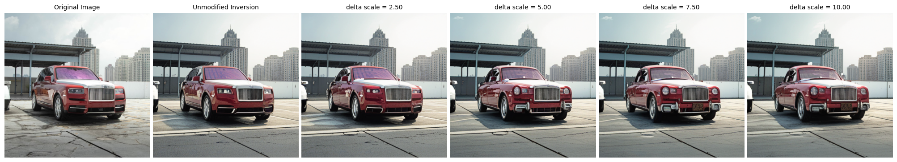

# Minimal Example of using our Edit Deltas for Real Image Editing

`sdxl_turbo_editing.ipynb` contains a simple example of performing inversion from a real image based on ReNoise ([*ReNoise: Real Image Inversion Through Iterative Noising*](https://garibida.github.io/ReNoise-Inversion/) by Garibi et al.) and changing attributes with our deltas for the re-generated version.

This allows you to do real image editing with our method, e.g. changing the age of a car:

This implementation uses SDXL Turbo by default to enable a nice user experience, but sacrifices a bit of inversion accuracy for that. You can also change the model to SDXL and play around with the inversion settings to get results that are closer to the original image.

## Code Licensing
This implementation borrows from [ReNoise's HF implementation](https://huggingface.co/spaces/garibida/ReNoise-Inversion/blob/main) that does not have clear licensing terms. The MIT license of the surrounding repository therefore does not apply in full for this part of the repository. Feel free to re-use everything in the notebook except for the inversion-related code under the MIT license though.
